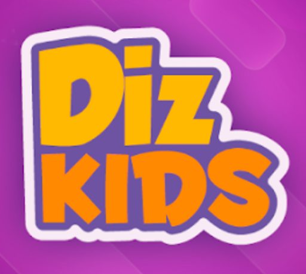

# Diskidz

  

#### 👨‍💻 By _**[Adán de la Rosa Lugo](https://github.com/AdanRL)**_

## 📚 Description

Diskidz it's an application to help monitor children with dyslalia problems. Diskidz offers a tool to tracking the progress of each patient with AR games and allow specialist to define personalized tratments.  
  
This is my TFG project for ULL.

## ⚙ Setup / Installation Requirements

### 1. Requirements

### 2. Clone and install dependences

## 🐞 Known Bugs

## 🤝 How to contribute

## ⚖️ License
